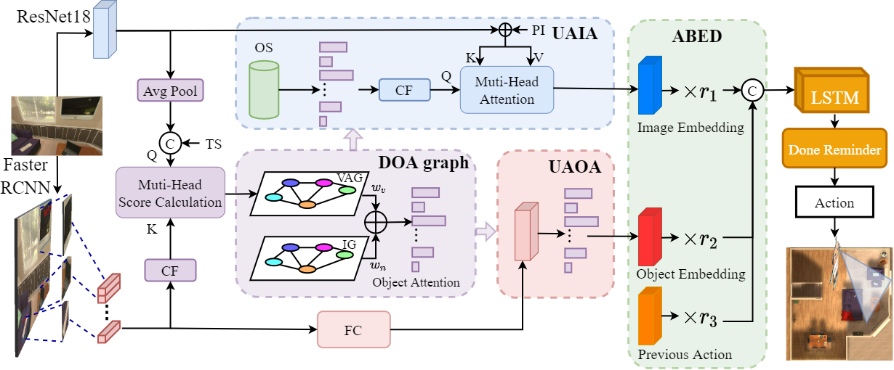

# Unbiased Directed Object Attention Graph for Object Navigation
Ronghao Dang, Zhuofan Shi, Liuyi Wang, Zongtao He, Chengju Liu, Qijun Chen (Under review for ACMMM 2022)

[Arxiv Paper](https://arxiv.org/abs/2204.04421)

<p align="center"></p>

## Abstract
We explore the object attention bias problem in object navigation task. Therefore, we propose the DOA graph and novel cross-attention method to solve the problem. Our overall model achieves a SOTA level.
## Setup
- Clone the repository `git clone http://github.com/gold-d/DOA.git` and move into the top level directory `cd DOA`
- Create conda environment. `conda env create -f environment.yml`
- Activate the environment. `conda activate ng`
- Download the [dataset](https://drive.google.com/file/d/1kvYvutjqc6SLEO65yQjo8AuU85voT5sC/view), which refers to [ECCV-VN](https://github.com/xiaobaishu0097/ECCV-VN). The offline data is discretized from [AI2-Thor](https://ai2thor.allenai.org/) simulator.
The `data` folder should look like this
```python
data/ 
    └── Scene_Data/
        ├── FloorPlan1/
        │   ├── resnet18_featuremap.hdf5
        │   ├── graph.json
        │   ├── visible_object_map_1.5.json
        │   ├── det_feature_categories.hdf5
        │   ├── grid.json
        │   └── optimal_action.json
        ├── FloorPlan2/
        └── ...
```
